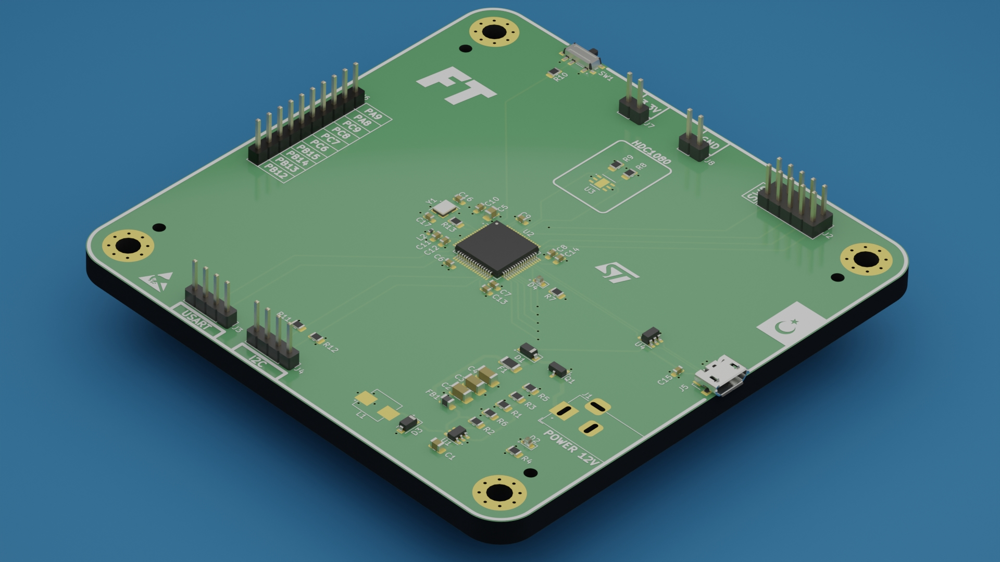
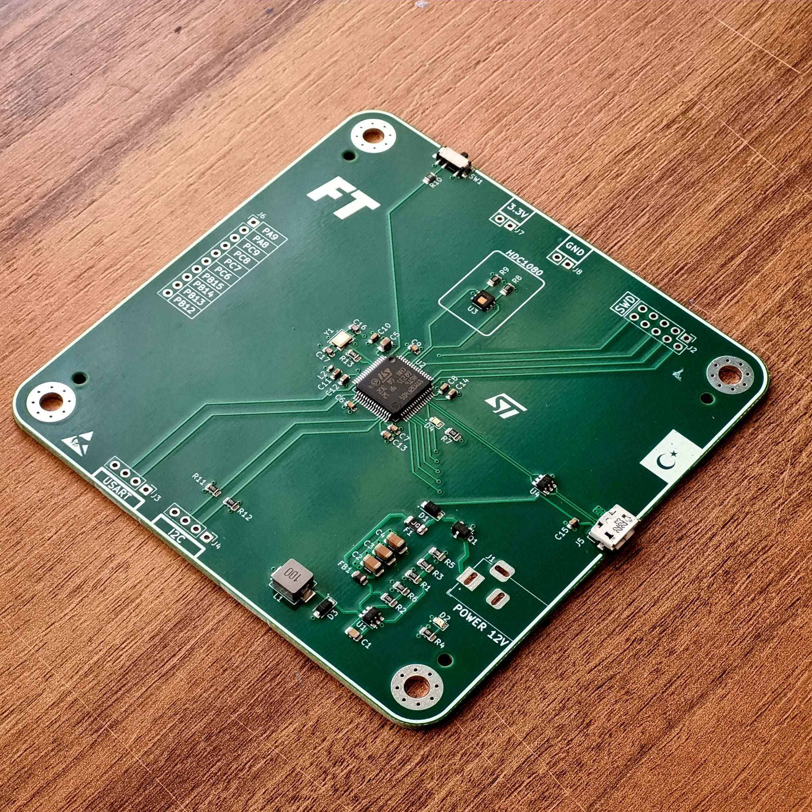

# _STM32F405RGT6 and HDC1080 Development Board_

In this project, a development board was designed using the STM32F405RGT6 processor, HDC1080 sensor and MP2359 step-down IC.
> [!NOTE]
> I rendered the PCB 3D file by transferring it to the Blender program and obtained this realistic image.
## _Components_

- **_STM32F405RGT6:_** The STM32F405RGT6 processor is ideal for high-performance embedded system applications with its 168 MHz processing speed and large memory capacity. I also chose this Microprocessor because it is affordable and new generation.

- **_HDC1080:_** The HDC1080 sensor provides high accuracy for temperature and humidity measurements. It works integrated with STM32F405RGT6 to provide accurate and reliable data. It can communicate with I2C Protocol. There may be alternatives instead of this sensor.

- **_MP2359:_** The MP2359 IC has a wide input voltage range. It saves energy with high efficiency Step-Down regulation. It is a well-known and widely used component.

> [!IMPORTANT]
> I designed the circuit design of these components in accordance with the datasheet. I drew the PCB Designs again in accordance with the Datasheet.

## _Components Recommended For Use (JLCPCB)_

- C13738 Crystal Oscillator
- C221841 Boot switch
- C408412 Power Inductor
- C132560 USB Connector

This information is also available in the BOM file.
## _PCB Image_

